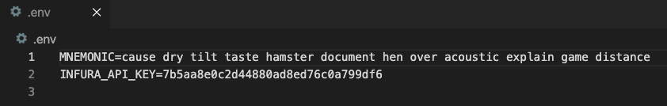
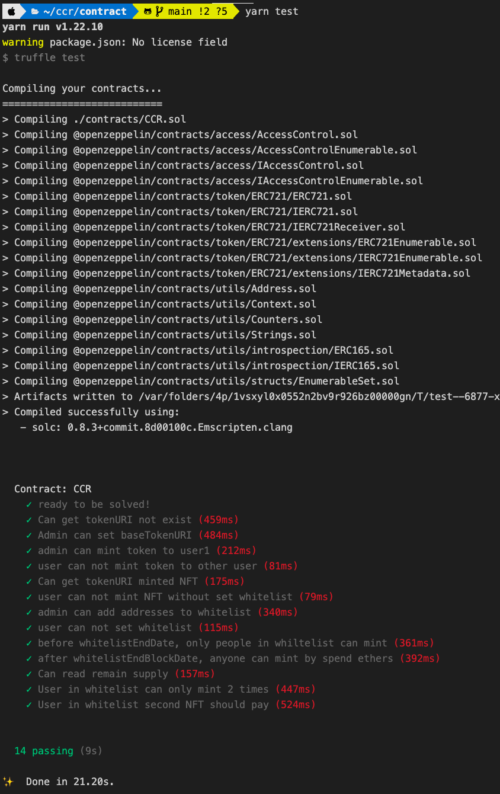
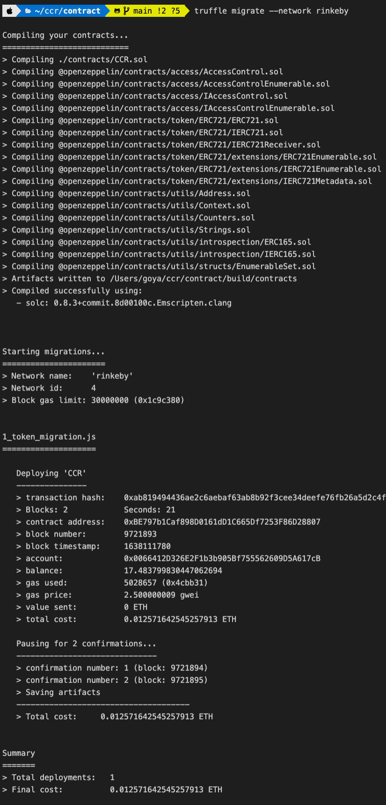
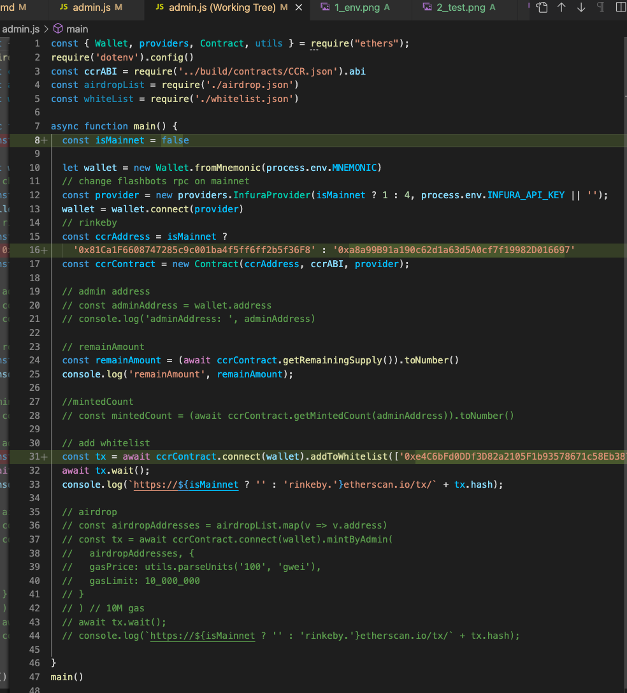
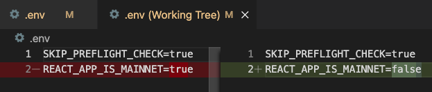
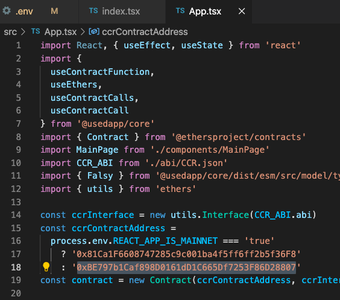
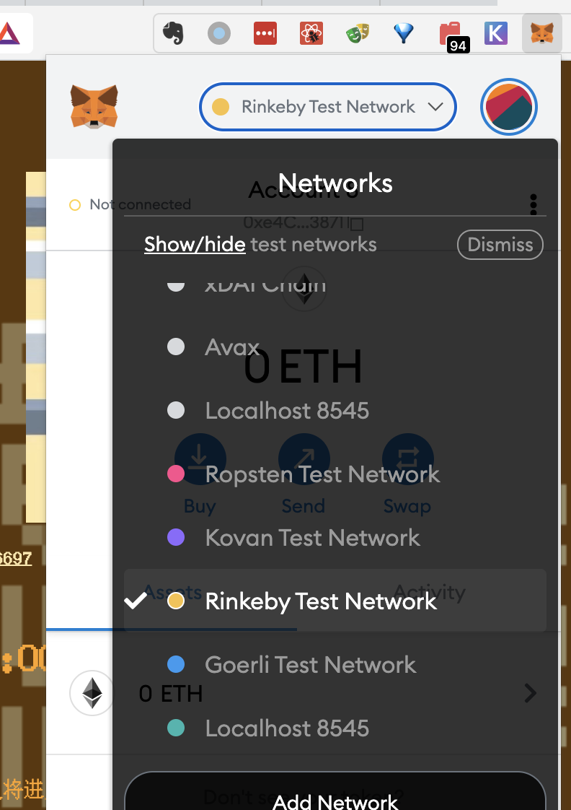
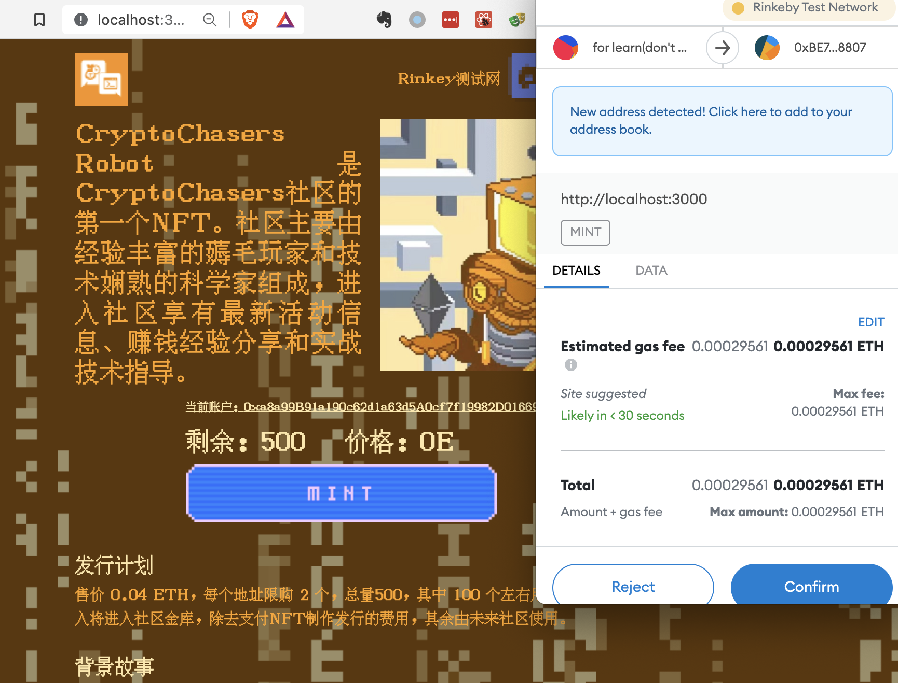
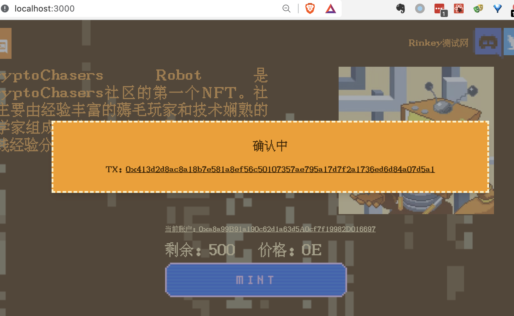
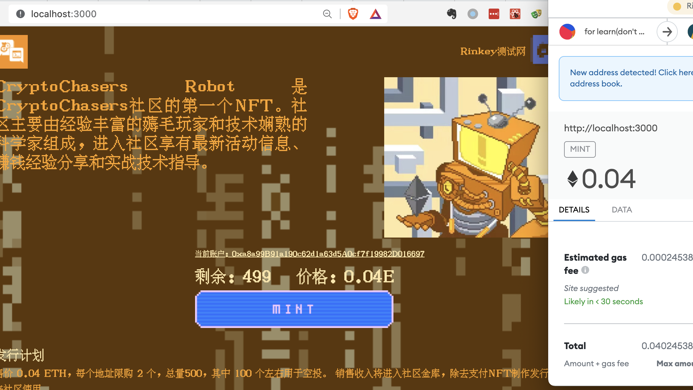

# blockchain-developer-bootcamp-final-project

learning goals: prepare build a PFP NFT project to learn solidity

## Public Ethereum account for NFT certificate

0x49E53Fb3d5bf1532fEBAD88a1979E33A94844d1d

## about this project

This is an avatar-based NFT project that I collaborated with a community artist for our community. The image compositing, contracts and front-end written by me.

website [link](https://robot.cryptochasers.co)

opensea [link](https://opensea.io/collection/cryptochasers-robot)

## directory structure

This repository is contract.

### contract

- The `./admin` folder is some code for airdrop and add whitelist
- The `./contracts` folder is main contract
- The `./migrations` is deploy scripts.
- The `./test` is unit test

### frontend

The frontend repository is [this](https://github.com/crypto-chasers/ccr-web)

I have some experience about frontend development, so I use useDapp, react-hook, storybook and tailwindcss to develop. Host on fleek.io.

## how to run

1. `cp .env.example .env` and fill information, prepare some rinkeby test eth
   
2. `yarn install` to install dependencies
3. `yarn test` to run unit test
   
4. `truffle migrate --network rinkeby` to deploy contract
   
5. modify and run `node ./admin/admin.js`
   
   1. line 8 to true
   2. line 16 second address to your contract address after migrate
   3. line 31 metamask address use to mint
   4. run `node ./admin/admin.js` to add whitelist
6. `git clone https://github.com/crypto-chasers/ccr-web.git` and `yarn install`
7. set .env file
   
8. set contract address at line 18 in `src/App.tsx`
   
9. use `yarn start` to run website
10. change to rinkey, and use account in whitelist to login
    
11. click "mint" to mint free
    
12. wait confirming
    
13. next mint need 0.04 eth
    
